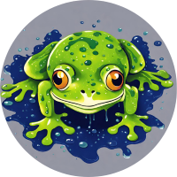

# Gooi: A Golang GUI Framework

An openGL based GUI framework built for desktop Golang applications. 

## Contents 
- Usage
- Dependencies 
- Documentation
  - Variables & Constants
  - Methods
- Examples

